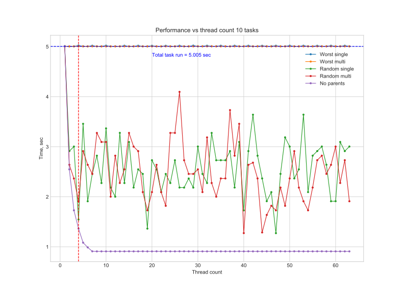
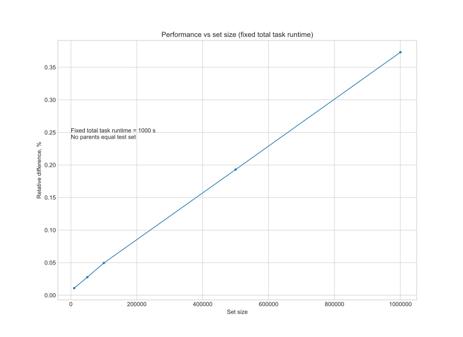

# task_manager

__task_manager__ is a tiny C++ library for encapsulating, sorting and launching weighted tasks (tasks with manually defined weights) with relationships in separate threads. This library can be used to build pipelines.

1. [Quickstart](#quick)
2. [Installation](#install)
3. [API reference](#descr)
4. [Performance](#perf)
5. [Example](#example)
6. [License](#license)

__Keywords__ 

_C++17_, _task management_, _thread pool_, _weighted task scheduling_, _directed acyclic graph_, _multithreading_.

# 1. Quickstart <a name="quick"></a>


__Source code:__

``` c++
// Cerate container for tasks and their results.
auto tasks = qp::task_vector();
auto results = std::vector<std::future<long>>();

//Create first task with weight 1 and emplace future result into results.
tasks.emplace( std::make_unique<qp::task>(1) );
results.emplace_back( tasks[0]->bind(test_job, 1, tasks[0]->id()) );

// ... add more tasks in the same way.

// Print tasks before sorting, sort them and print again.
cout_tasks("Initial set:", tasks);
tasks.sort();
cout_tasks("Sorted set:", tasks);

// Launch task manager with 2 threads and wait for it
// (another option is to get futures).
auto tm = qp::task_manager(std::move(tasks), 2);
std::cout << "Running task manager:" << std::endl;
tm.run();
tm.wait();

```
__Output results:__

```cpp
Initial set:
   > id: 1 weight: 1 parents:
   > id: 2 weight: 5 parents: 1
   > id: 3 weight: 2 parents:
   > id: 4 weight: 10 parents: 1 3
Sorted set:
   > id: 3 weight: 2 parents:
   > id: 1 weight: 1 parents:
   > id: 4 weight: 10 parents: 1 3
   > id: 2 weight: 5 parents: 1
Running task manager:
   > thread: 1  start job. id: 3 weight: 2
   > thread: 2  start job. id: 1 weight: 1
   > thread: 2 finish job. id: 1 weight:1
   > thread: 2  start job. id: 2 weight: 5
   > thread: 1 finish job. id: 3 weight:2
   > thread: 1  start job. id: 4 weight: 10
   > thread: 2 finish job. id: 2 weight:5
   > thread: 1 finish job. id: 4 weight:10
Finished. Press Enter to exit...
```

For more details see ```example/main.cpp```.

__Use case__

1. Create your tasks using ```task_vector```.
2. Set relationships between them.
3. Measure the time spend for tasks execution once - that is the weight of the tasks.
4. Execute tasks with ```task_manager``` in several threads to accelerate your computations.
5. Task results can be accessed through the ```std::future``` in order your program requires them - ```task_manager``` will do rest of the work.


# 2. Installation <a name="install"></a>

__Quickstart:__ Just copy folders ```src``` and ```include``` into your project and include ```include/task_manager.hpp```.

__Requirements:__ C++17.


# 3. API Reference <a name="descr"></a>

Library has its own namespace ```qp``` and contains 3 classes ```task```, ```task_vector``` and  ```task_manager```.

Library uses typedef (syntax sugar):

- ```typedef unsigned long long task_id``` - for tracking ```task```s and setting their relationships.

## qp::task

__Description__

A non-copyable class for task encapsulation. 

Each task object has its own unique __id__:
- id has a type of _unsigned long long_ (typedef ```task_id``` in ```task.hpp```).
- id starts from 1.
- id is generated and assigned automatically.
- id is read-only.

Each task has _int_ __weight__. Weight is a user-defined value that helps ```task_manager``` to launch tasks in optimal order: heavy tasks must be done as soon as possible. The larger weight - the heavier task.

Each task may have __parents__:
- task can't be executed before its parent.
- task's parent is assigned by parent's id.

__Constructors__

1. ```task(int weight)``` - creates a new task with the given weight.
2. ```task(int weight, task_id parent_id)``` - creates a new task with the given weight and parent.
3. ```task(int weight, const std::vector<task_id> & parent_id)``` - creates a new task with the given weight and parents.
4. ```task(task && Task)``` - moves everything from the input Task including its ```id``` to a new task.

__Methods__

1. ```task_id id() const``` - return id of the task.
2. ```std::vector<task_id> parents() const``` - returns vector of parents' IDs.
3. ```int weight() const``` -  returns weight of the task.
4. ```virtual void execute()``` - starts executing function/lambda that was assigned to a task within ```bind``` method.
5. ```decltype(auto) bind(Func && func, Args && ... args)``` - assigns a function to a task. Returns ```std::future```.


## qp::task_vector

__Description__

A non-copyable container for storing ```task```s. ```task_vector``` is just a ```std::vector``` of ```std::unique_ptr<task>```s under the hood with some additional information stored such as done status.

- This class is not a thread safe container, thus it is protected by a mutex in the ```task_manager``` class.
- It is only recommended to use this class as a container for moving tasks into a ```task_manager```.

__Constructors__ 

1. ```task_vector()``` - creates a new empty task vector.
2. ```task_vector(task_vector && TaskVector)``` - moves everything from the input TaskVector to a newly created task vector.

__Methods__

1. ```void emplace(std::unique_ptr<task> Task)``` - moves input Task to a task vector.
2. ```void clear()``` - removes all tasks from the task vector.
3. ```void reserve(size_t Size)``` - requests that the task vector's capacity be at least enough to contain Size elements.
4. ```size_t size() const``` - return number of tasks contained in the task vector.
5. ```bool sort()``` - sorts the tasks in optimal exectuing order. Algorithm's complexity is mostly determined by ```std::stable_sort```: __O( (n+v)\*log(n) )__, where __n__ - set size, __v__ - number of relationships. Requires additional space __O(n)__.
   - Returns false if not all parents are present in the input task vector passed to constructor. Othwerwise returns true.
6. ```bool pop_next(std::unique_ptr<task> & OutTask)``` - moves to the input OutTask next task in queue, that must be executed. If no available tasks to be executed - nothing to happen with OutTask.
   - Returns false if the last task was returned, otherwise - true.
7. ```void set_done(task_id TaskId)``` - sets done status to a task with the input TaskId. This method should be called after task execution was finished.
8. ```void shuffle()``` - randomly shuffles tasks contained in the task vector.


__Overloads__
1. ```std::unique_ptr<task> & operator[](size_t i)``` - return reference to a certain ```std::unique_ptr<task>``` contained in a task vector. If ```i``` index is not peresent in a task vector, ```out of range``` exception will be thrown.


## qp::task_manager

__Description__

A non-copyable class for launching tasks in optimal order using thread pool.

Number of threads used by ```task_manager``` is defined by user (but not less than 1).
- it is recommended to determine optimal number of threads for your use case.
- some ideas may be found in [test_results.md](https://github.com/Chivelazur/task_manager/blob/master/test_results.md).
- if you just want to use multithreading - use ```std::thread::hardware_concurrency```.

Remeber to make shared by tasks data thread-safe.

__Constructors__

1. ```task_manager(task_vector && TaskVector, int ThreadCount = 1)``` - creates a new task manager. The constructor just places the tasks without sorting and launching.

__Methods__

1. ```void run()``` - runs the task manager: sorts the ```task_vector``` and start executing them in a thread pool.
    - If task manager is already running - nothing will happen.
    - If task manager had finished and was runned again - it will start executing tasks again.
    - If task can't be sorted - ```runtime error``` will be thrown.
2. ```void wait()``` - waits for task manager to finish and joins the threads in a thread pool.


# 4. Performance <a name="perf"></a>

## 4.1 Description <a name="descr"></a>

- Compiler: MSVC v142, flag \O2.
- Processor: Intel Core i5-7200U 2.50 GHz.
- RAM: 8 Gb.
- Date: 2020-07-01

## 4.2 Test sets <a name="sets"></a>

Test sets are generated by static class ```task_generator```. There are 6 types of test sets:

__1. Worst single__
   
- weights: arithmetic progression with a1 = d.
- parents: 1 -> 2 -> 3 -> 4 -> ... -> 100
- order: randomly shuffled.


__2. Worst multi__

- weights: arithmetic progression with a1 = d.
- parents: 1 -> 2, 3, 4, ... 100 and 2 -> 3, 4, ... 100 and ... 99 -> 100.
- order: randomly shuffled.


__3. Random single__

- weights: random from arithmetic progression with a1 = d.
- parents: i-th task has one random parent from 0 to i-1.
- order: randomly shuffled.


__4. Random multi__

- weights: random from arithmetic progression with a1 = d.
- parents: i-th task has random number of random parents from 0 to i-1.
- order: randomly shuffled.


__5. No parents__

- weights: arithmetic progression with a1 = d.
- parents: no parents.
- order: randomly shuffled.


__6. No parents equal__

- weights: equal.
- parents: no parents.
- order: no matter.


For more details see ```test/task_generator```'s source code.


## 4.3 Sorting algorithm

- __Description:__ checking sorting performance in range from 10k to 10m on test sets _Worst single_, _Random single_, _No parents_.
- __Ref:__ ```test::sort_performance()``` method in ```test/test.hpp```.


- Algorithm's complexity is mostly determined by ```std::stable_sort```: __O( (n+v)\*log(n) )__, where __n__ - set size, __v__ - number of relationships. Requires additional space __O(n)__

## 4.4 Performance vs thread count

- __Description:__ checking performance vs thread count on different test sets.
- __Ref:__ ```test::performance_vs_thread()``` method in ```test/test.hpp```.
- __Notes:__
   - Total runtime of each test set: 5 seconds (blue horizontal dashed line).
   - Processor's number of threads: 4 (red vertical dashed line).



1. _No parents_ has a lower limit starting from 7 threads because of the largest task in a set.
2. _Worst single_ and _Worst multi_ has a runtime ~5 seconds because all the tasks are done in one thread.


1. _Random single_ in case of many tasks and enough number of threads looks like a _No parents_ set.
2. A tiny offset for _Worst single_ and _Worst multi_ has a place because of the increased set size - more time required for sorting and managing tasks (see next sections).

## 4.5 Performance vs set size (fixed total runtime)

- __Description:__ checking task_manager's overhead on _No parents equal_ test set. The total task runtime is fixed to 100s. Only 1 thread is used.
- __Ref:__ ```test::performance_vs_set_size_fixed_total_runtime()``` method in ```test/test.hpp```.

|Set size| Task duration, ms | Direct call, s | Task manager, s | Difference, s | Difference, % |
|--------|--------|---------|--------|--------|--------|
|1000|100|100.002|100.009|0.007|0.007|
|2000|50|100.000|100.017|0.017|0.017|
|5000|20|100.004|100.025|0.021|0.021|
|10000|10|100.007|100.048|0.041|0.041|
|50000|2|100.032|100.198|0.166|0.166|
|100000|1|100.064|100.331|0.267|0.267|



- Overhead caused by sorting tasks (see section above) and managing them - wrapping into ```std::packaged_task```, etc. Direct call of tasks is free from that stuff.

## 4.6 Performance vs set size (fixed task duration)

- __Description:__ checking task_manager's overhead on _No parents equal_ test set. The duration of each task is fixed to 1 ms. Only 1 thread is used.
- __Ref:__ ```test::performance_vs_set_size_fixed_task_duration()``` method in ```test/test.hpp```.

|Set size| Task duration, ms | Direct call, s | Task manager, s | Difference, s | Difference, % |
|--------|--------|---------|--------|--------|--------|
|10000|1|10.007|10.031|0.024|0.240|
|20000|1|20.014|20.058|0.044|0.220|
|50000|1|50.027|50.156|0.129|0.258|
|100000|1|100.056|100.383|0.327|0.327|
|500000|1|500.258|502.129|1.871|0.374|
|1000000|1|1000.73|1004.53|3.799|0.380|


## 4.7 Conclusions

- Algorithm's complexity is mostly determined by ```std::stable_sort```: __O( (n+v)\*log(n) )__, where __n__ - set size, __v__ - number of relationships. Requires additional space __O(n)__

- Use number of threads in accordance with your processor's parameters in case you don't have tests of your task set.

- For practical usage - high-level computations and building pipelines - task_manager has negligeable small overhead ~0.5% comparing to launching tasks without ```task```, ```task_vector``` and ```task_manager``` classes in the range from 10k to 1b tasks.

# 5. Example <a name="example"></a>

- __Source code:__ ```test::task_manager_wait()``` method in ```test/test.hpp```.
- __Notes:__
   - Here weight = milliseconds. 
   - Thread count: 4.

__Initial set:__

``` c++
   > id: 41 weight: 600 parents_id:
   > id: 40 weight: 70 parents_id: 30 31 38 36
   > id: 37 weight: 100 parents_id: 36 35
   > id: 38 weight: 500 parents_id: 37
   > id: 28 weight: 20 parents_id: 27
   > id: 36 weight: 300 parents_id:
   > id: 27 weight: 10 parents_id:
   > id: 34 weight: 30 parents_id: 27
   > id: 35 weight: 1000 parents_id: 27
   > id: 44 weight: 400 parents_id:
   > id: 26 weight: 1000 parents_id:
   > id: 43 weight: 700 parents_id: 42
   > id: 42 weight: 10 parents_id:
   > id: 31 weight: 20 parents_id:
   > id: 32 weight: 10 parents_id:
   > id: 39 weight: 100 parents_id: 29 30
   > id: 29 weight: 30 parents_id:
   > id: 30 weight: 80 parents_id:
   > id: 33 weight: 20 parents_id: 27
```

__After sorting:__

``` c++
   > id: 27 weight: 10 parents_id:
   > id: 35 weight: 1000 parents_id: 27
   > id: 26 weight: 1000 parents_id:
   > id: 42 weight: 10 parents_id:
   > id: 43 weight: 700 parents_id: 42
   > id: 41 weight: 600 parents_id:
   > id: 36 weight: 300 parents_id:
   > id: 37 weight: 100 parents_id: 36 35
   > id: 38 weight: 500 parents_id: 37
   > id: 44 weight: 400 parents_id:
   > id: 30 weight: 80 parents_id:
   > id: 29 weight: 30 parents_id:
   > id: 39 weight: 100 parents_id: 29 30
   > id: 31 weight: 20 parents_id:
   > id: 40 weight: 70 parents_id: 30 31 38 36
   > id: 34 weight: 30 parents_id: 27
   > id: 28 weight: 20 parents_id: 27
   > id: 33 weight: 20 parents_id: 27
   > id: 32 weight: 10 parents_id:
```

__Executing tasks:__

``` c++
   > this should appear right now
   > thread: 1  start job. id: 2 weight: 10
   > thread: 2  start job. id: 1 weight: 1000
   > thread: 3  start job. id: 17 weight: 10
   > thread: 4  start job. id: 16 weight: 600
   > thread: 3 finish job. id: 17 weight: 10 parents_id:
   > thread: 1 finish job. id: 2 weight: 10 parents_id:
   > thread: 1  start job. id: 10 weight: 1000
   > thread: 3  start job. id: 18 weight: 700
   > thread: 4 finish job. id: 16 weight: 600 parents_id:
   > thread: 4  start job. id: 11 weight: 300
   > thread: 3 finish job. id: 18 weight: 700 parents_id: 17
   > thread: 3  start job. id: 19 weight: 400
   > thread: 4 finish job. id: 11 weight: 300 parents_id:
   > thread: 4  start job. id: 5 weight: 80
   > thread: 4 finish job. id: 5 weight: 80 parents_id:
   > thread: 4  start job. id: 4 weight: 30
   > thread: 2 finish job. id: 1 weight: 1000 parents_id:
   > thread: 2  start job. id: 6 weight: 20
   > thread: 1 finish job. id: 10 weight: 1000 parents_id: 2
   > thread: 1  start job. id: 12 weight: 100
   > thread: 4 finish job. id: 4 weight: 30 parents_id:
   > thread: 2 finish job. id: 6 weight: 20 parents_id:
   > thread: 2  start job. id: 9 weight: 30
   > thread: 4  start job. id: 14 weight: 100
   > thread: 2 finish job. id: 9 weight: 30 parents_id: 2
   > thread: 2  start job. id: 3 weight: 20
   > thread: 2 finish job. id: 3 weight: 20 parents_id: 2
   > thread: 2  start job. id: 8 weight: 20
   > thread: 2 finish job. id: 8 weight: 20 parents_id: 2
   > thread: 2  start job. id: 7 weight: 10
   > thread: 2 finish job. id: 7 weight: 10 parents_id:
   > thread: 3 finish job. id: 19 weight: 400 parents_id:
   > thread: 1 finish job. id: 12 weight: 100 parents_id: 11 10
   > thread: 3  start job. id: 13 weight: 500
   > thread: 4 finish job. id: 14 weight: 100 parents_id: 4 5
   > thread: 3 finish job. id: 13 weight: 500 parents_id: 12
   > thread: 1  start job. id: 15 weight: 70
   > thread: 1 finish job. id: 15 weight: 70 parents_id: 5 6 13 11
   > this should appear after task_manager finished
   > elapsed time: 1.702000
```

# 6. License <a name="license"></a>

This project is licensed under the terms of the MIT license.

Copyright (c) 2020 Albert Shaykhutdinov, chivelazur@gmail.com